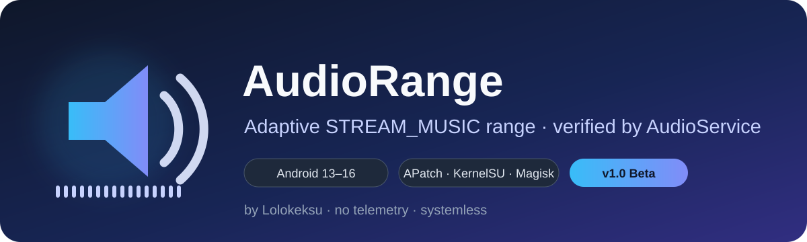

<p align="center">
  
</p>

<p align="center">
  <a href="https://github.com/lolokeksu/AudioRange/releases/tag/v1.0.0-beta.1"></a>
  <a href="https://github.com/lolokeksu/AudioRange/actions/workflows/ci.yml"></a>
  
  <a href="LICENSE"></a>
</p>

<p align="center"><a href="README.md">English</a> · <a href="https://github.com/lolokeksu/AudioRange/releases">Релизы</a> · <a href="SECURITY.md">Безопасность</a></p>

---

# AudioRange

AudioRange — systemless-модуль Android, который изменяет логическое число ступеней `STREAM_MUSIC` и проверяет результат по реальному диапазону Android `AudioService`.

## Статус релиза

**v1.0.0-beta.1 — первый публичный beta-релиз.** В репозитории находятся полные исходники, автоматические проверки и воспроизводимая сборка релизов.

Подтверждённая среда:

| Устройство | Android | Root | Результат |
|---|---:|---|---|
| Realme GT Neo 5 SE / RMX3700 | 13 / API 33 | APatch | подтверждено `STREAM_MUSIC 0–30` |

Другие прошивки и root-менеджеры остаются экспериментальными до реальных отчётов.

## Что изменяет модуль

Только системное свойство:

```properties
ro.config.media_vol_steps
```

Оно применяется systemless через `system.prop` и ранний `post-fs-data.sh`, после чего фактический максимум проверяется командой:

```sh
cmd media_session volume --stream 3 --get
```

Модуль не повышает мощность усилителя, не патчит framework JAR, Audio HAL или Audio Policy, не отключает SELinux/AVB и не изменяет загрузочные разделы.

## Адаптивная совместимость

Результаты привязаны к точному fingerprint прошивки и хранятся локально в `/data/adb/audiorange/compatibility.conf`. После OTA старая база не переносится на новый fingerprint.

Встроенный предел 30 применяется только к точной исследованной прошивке RMX3700. Он не считается общим пределом Realme, OPPO, OnePlus или Android.

## Управление

- компактный WebUI для APatch и KernelSU;
- Manager Action только для чтения;
- CLI: `su -c audiorange`;
- профили Stock, 30, 50, 75, 100 и пользовательский 15–100;
- диагностика, проверка целостности, конфликты, отчёт и история;
- безопасный временный тест громкости с автоматическим восстановлением.

## Установка

Установите ZIP через APatch, KernelSU или Magisk и перезагрузите Android. Затем выполните:

```sh
su -c audiorange check
su -c audiorange doctor
```

Возврат к штатной шкале:

```sh
su -c audiorange stock
su -c reboot
```

При bootloop создайте `/data/adb/modules/audiorange/disable` через recovery/ADB либо удалите каталог модуля.

## Сборка

```sh
./scripts/test.sh
./scripts/build.sh
```

Воспроизводимые архивы модуля и исходников создаются в `dist/` вместе с `SHA256SUMS`.
